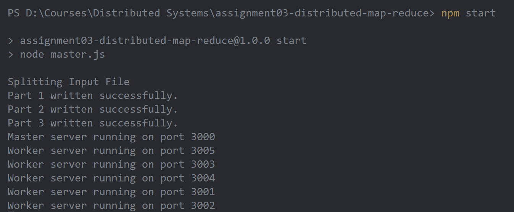
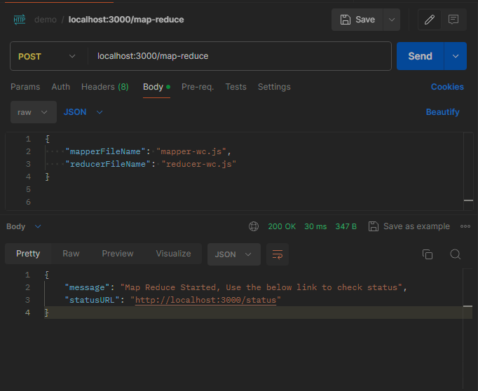
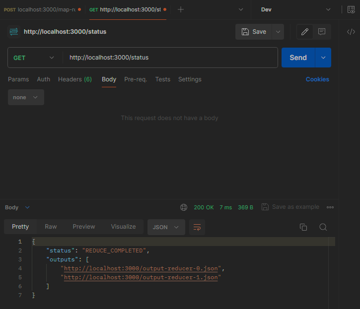
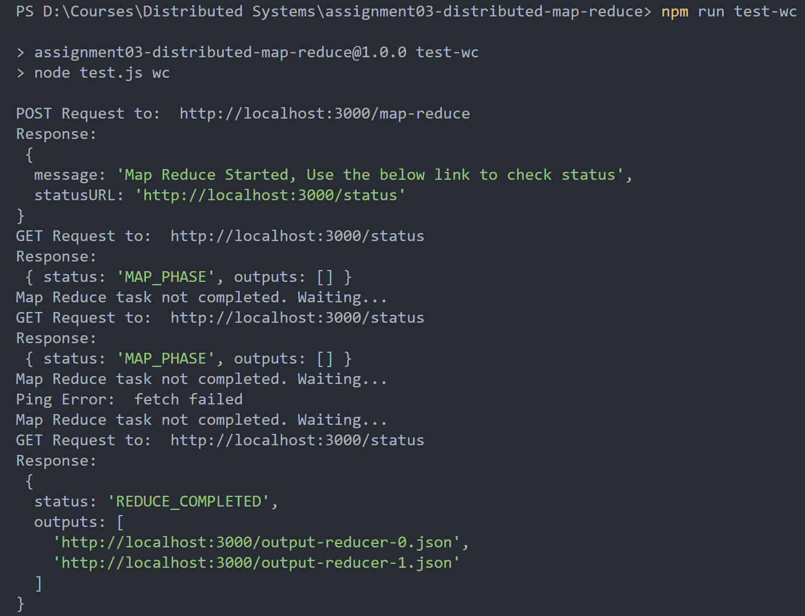
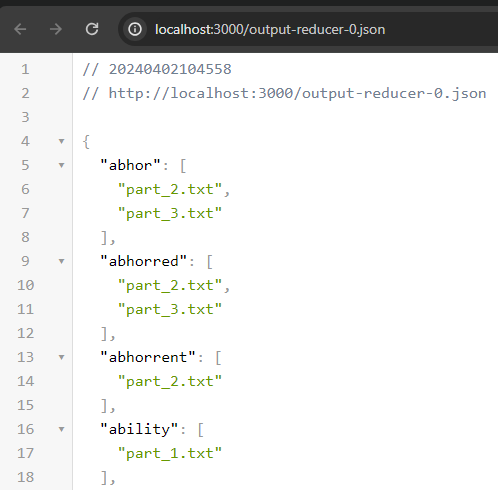
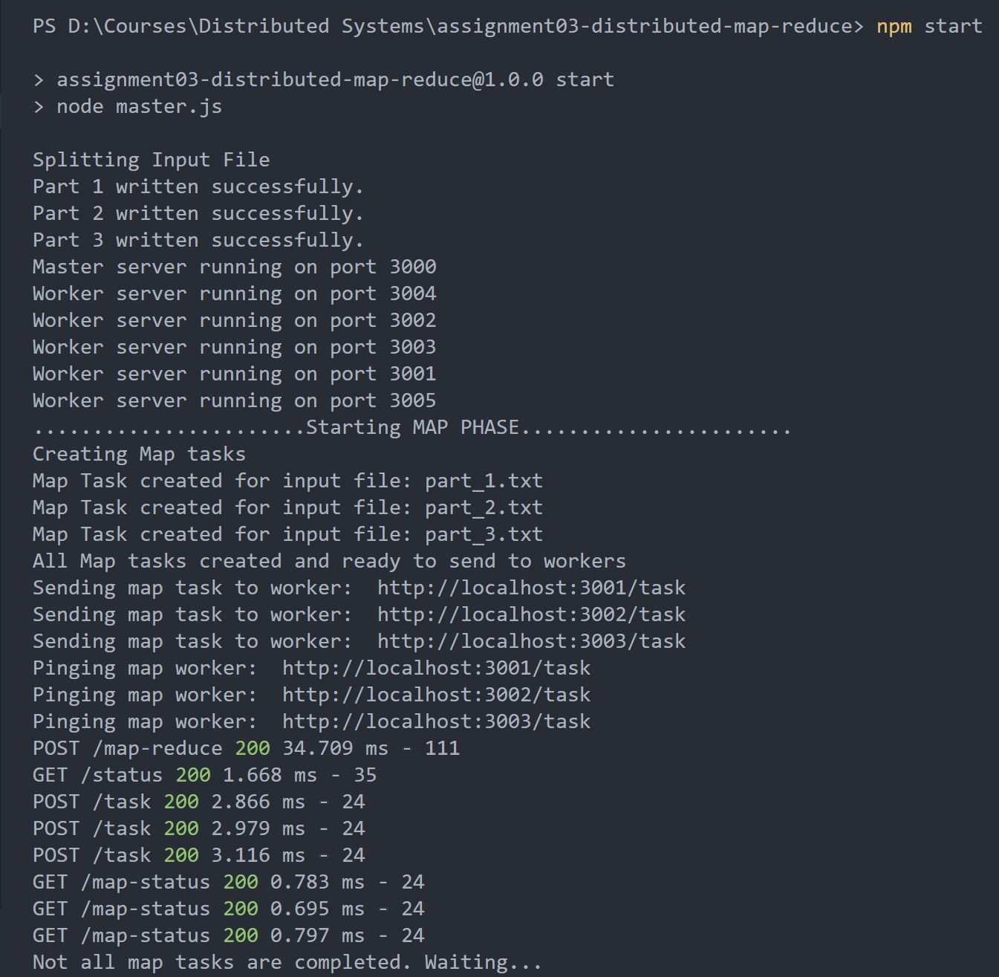
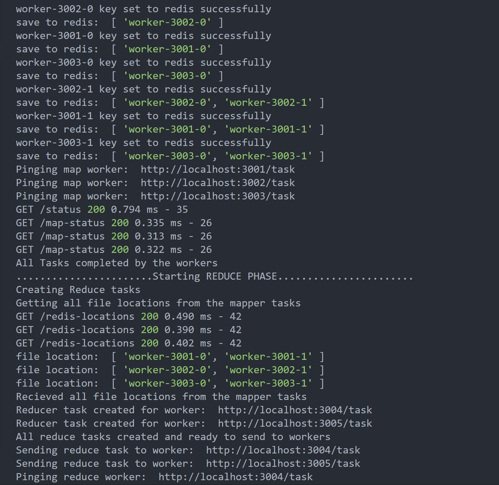
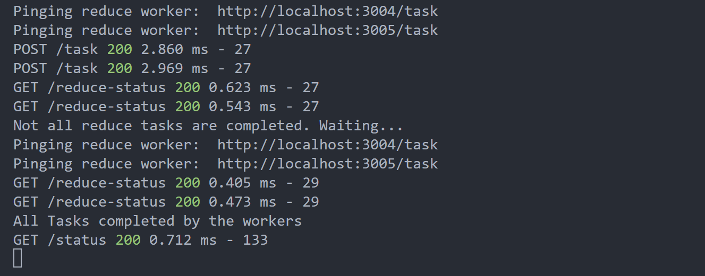

## 1. Prerequisites

- Node.js: Ensure that Node.js is installed on your system. You can download the LTS from [https://nodejs.org/en](https://nodejs.org/en)

- npm Packages: Open a terminal and navigate to the project directory. Run the following command to install the required npm packages.

  ```js
  npm install
  ```

## 2. Using the Application

- Open a terminal and navigate to the project directory. Run the following command to initialize MapReduce Library.
- You can also change the content in the input.txt file under public directory as per your usecase.

  ```js
  npm start
  ```

    
  <br>

- Now Make an HTTP POST request to start the map reduce task. Currently the application offers count frequency (`mapper-wc.js`, `reducer-wc.js`) and inverted-index (`mapper-iv.js`, `reducer-iv.js`).
- You can add more examples(mapper.js, reducer.js) as per your usecase under the public folder. Make sure that while making the api call mention the required filenames that you added.

  **API Endpoint:** `http:localhost:3000/map-reduce`

  **Body:**

  ```json
  {
    "mapperFileName": "mapper-wc.js",
    "reducerFileName": "reducer-wc.js"
  }
  ```

    

  <br>

- Make an HTTP GET request to get the status of your map reduce task.

  **API Endpoint:** `http:localhost:3000/status`

  **Response:**

  ```json
  {
    "mapperFileName": "mapper-wc.js",
    "reducerFileName": "reducer-wc.js"
  }
  ```

    

## 3. Auto Testing

1. The above process requires some effort to install postman or any other http client. Hence as an alternative way `test.js` does the some thing as mentioned above for you.

- Open a terminal and navigate to the project directory. Run the following command to initialize MapReduce Library.

  ```js
  npm start
  ```

- Open another terminal and navigate to the project directory. Run the following command to test the application with either word-count or inverted-index.

  ```js
  npm run test-wc
  ```

  ```js
  npm run test-iv
  ```

    
  <br>

- You can click on the links provided in outputs array to check the output from each reducer.
- I am using json viewer extension in chrome for pretty printing. Open source at https://goo.gl/fmphc7
  <br>  
  

## 4. Application Logs




