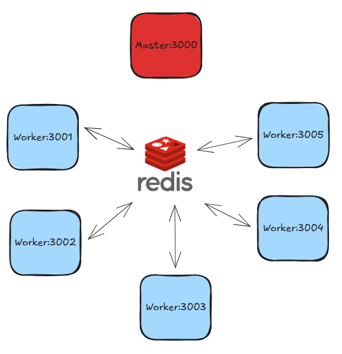
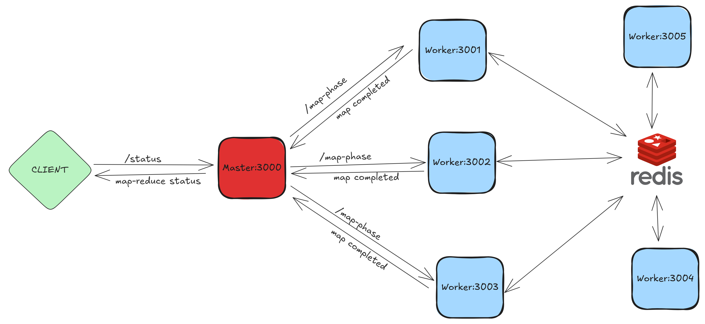
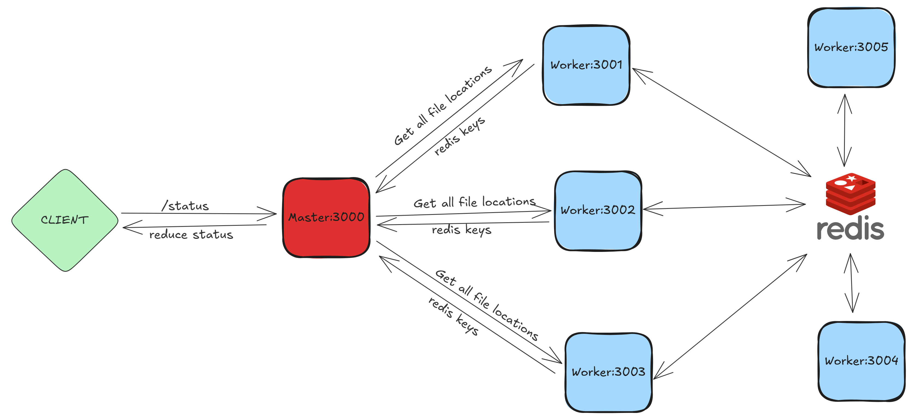
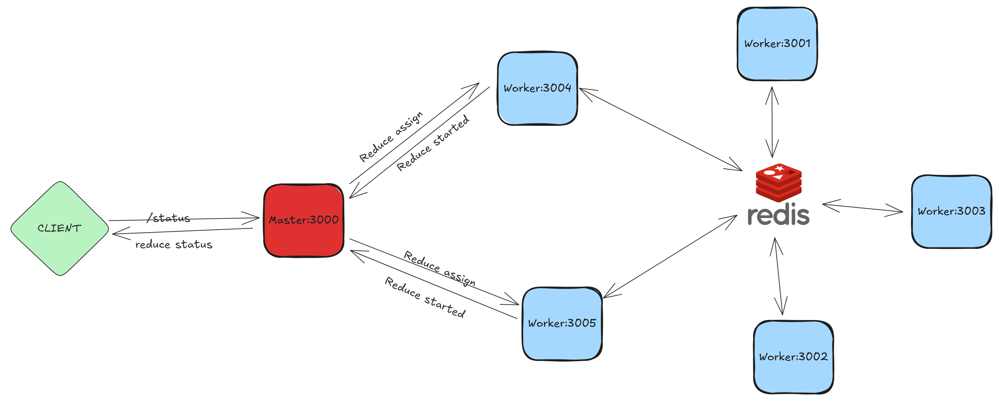
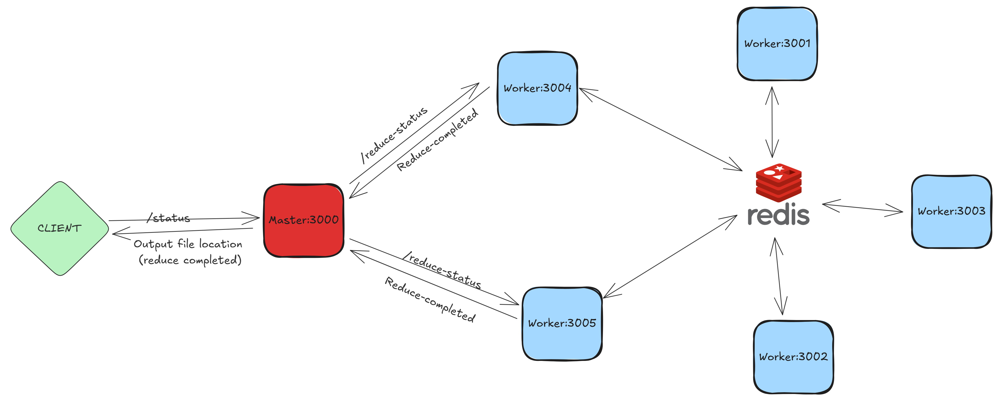
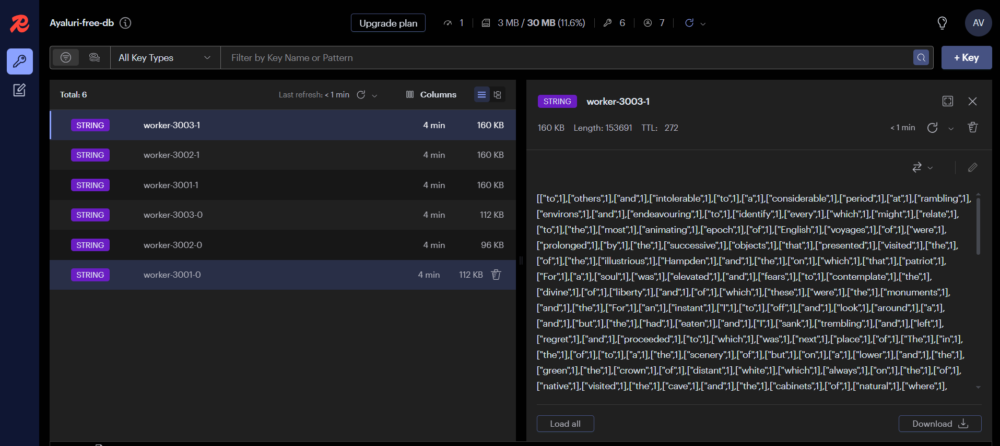

## How the Application Works (Overview)

#### A. When the application is started



1. Upon launching the application, a cluster of Node.js Express servers is initialized, with six servers distributed across ports 3000 through 3005. The master server is designated to port 3000, while the remaining servers act as workers, sharing identical functionalities. These worker servers are versatile, capable of dynamically adapting as either mappers or reducers in response to tasks dispatched by the master server. Also Each worker is connected to a redis key value store to SET/GET intermediate key-value pairs.

2. Also the input file is splitted into three (`NUM_MAPPERS`) separated files. so that each mapper gets an equal chunk of the file. Refer `fileSplitter.js` for implementation details.

#### B. When the user makes a Map Reduce Request


1. Use any HTTP client to send a POST request to `http://localhost:3000/map-reduce` with the following JSON body:

   ```json
   {
     "mapperFileName": "mapper-wc.js",
     "reducerFileName": "reducer-wc.js"
   }
   ```

2. Master worker sends back the response:

   ```json
   {
     "message": "Map Reduce Started, Use the below link to check status",
     "statusURL": "http://localhost:3000/status"
   }
   ```

3. And the master worker internally makes POST requests to workers: 3001, 3002, 3003 to execute map tasks. Related code can be found in `master-server.js` under `createMapTasks` function

   **URL:** http://localhost:3001/task

   **Body:**

   ```json
   {
     "taskType": "map",
     "inputFilePath": "part_1.txt",
     "mapperFilePath": "mapper.js",
     "numReducers": 2
   }
   ```

4. Upon receiving the task, the worker server responds to master with:

   ```json
   {
     "status": "MAP_RUNNING"
   }
   ```

#### C. How master knows the status of map workers



1. The master server keeps pinging the worker servers by making GET requests to check whether they completed the map tasks. Related code can be found in `master-server.js` under `pingTasks` function

   **URL:** http://localhost:3001/map-status

   ```json
   {
     "status": "MAP_COMPLETED"
   }
   ```

2. Meanwhile if an user makes a GET request `http://localhost:3000/status` to the master server to check the status, following response is recieved:

   ```json
   {
     "status": "MAP_PHASE",
     "outputs": []
   }
   ```

#### D. How master knows the intermediate file locations of map workers



1.  Once all map tasks are completed, the master server moves to the reduce phase. The first step is to collect all file locations from the map workers. In this scenario, file locations refer to the keys stored in Redis. Related code can be found in `master-server.js` under `pingTasks` function

    **URL:** http://localhost:3001/redis-locations

    ```json
    {
      "keys": ["worker-3001-0", "worker-3001-1"]
    }
    ```

2.  Meanwhile if an user makes a GET request `http://localhost:3000/status` to the master server to check the status, following response is recieved:

    ```json
    {
      "status": "REDUCE_PHASE",
      "outputs": []
    }
    ```

#### E. Master assigning reduce tasks



1. After getting all the file locations, the master worker makes POST requests to workers: 3004, 3005 to execute reduce tasks. Related code can be found in `master-server.js` under `createReduceTasks` function

   **URL:** http://localhost:3004/task

   **Body:**

   ```json
   {
     "taskType": "reduce",
     "fileLocations": ["worker-3001-0", "worker-3002-0", "worker-3003-0"],
     "reducerFilePath": "reducer.js",
     "outputFilePath": "output-reducer-0.js"
   }
   ```

2. Upon receiving the task, the worker server responds to master with:

   ```json
   {
     "status": "REDUCE_RUNNING"
   }
   ```

3. Meanwhile if an user makes a GET request `http://localhost:3000/status` to the master server to check the status, following response is recieved:

   ```json
   {
     "status": "REDUCE_PHASE",
     "outputs": []
   }
   ```

#### F. How master knows the status of reduce workers



1. The master server keeps pinging the worker servers by making GET requests to check whether they completed the reduce tasks. Related code can be found in `master-server.js` under `pingTasks` function

   **URL:** http://localhost:3004/reduce-status

   ```json
   {
     "status": "REDUCE_COMPLETED"
   }
   ```

2. Once all reduce tasks are completed, the master server moves to the reduce completed phase. If an user makes a GET request `http://localhost:3000/status` to the master server to check the status, following response is recieved:

   ```json
   {
     "status": "REDUCE_COMPLETED",
     "outputs": [
       "http://localhost:3000/output-reducer-0.json",
       "http://localhost:3000/output-reducer-1.json"
     ]
   }
   ```

## Worker behaving has MAP

**1. Task Assignment:** Workers receive tasks from a master node. The type of task assigned determines how the worker will process it, following the map/reduce paradigm.

**2. Initial Response:** Upon receiving a task, the worker immediately responds to the master, indicating that it has started processing the task. This response likely includes the current state of the worker, such as "map running."

**3. Execution of Map Task:** The worker executes the map task using the `execMap` function defined in `worker.js`. This function performs several steps:

- Reads the code from a file path (`mapperFilePath`) provided by the master.
- Reads the content from another file path (`inputFilePath`) provided by the master.
- Executes the map function defined in the code file, passing the filename and content as parameters.

**4. Partitioning:** The key-value pairs generated by the map function are partitioned into a predetermined number of parts, typically corresponding to the number of reducers in the system. In this case, it partitions the pairs into two parts (`NUM_REDUCERS`).

**5. Storage in Redis:** The partitions are then saved in Redis, a data structure store. Each partition is saved under a specific key, indicating the worker's identity and the partition number. For example, `"worker-3001-0"` and `"worker-3001-1"` represent keys for partitions generated by a worker with PORT `3001`, with `-0` and `-1` denoting the partition numbers. The corresponding values are lists of key-value pairs from the respective partitions. Refer `partitionKeyValueList` function defined in `utils.js` to see how the hash function is used to partition the list of key-value pairs.



## Worker behaving has REDUCE

Task assignment and initial response are simillar to that of MAP worker.

**1. Execution of REDUCE Task:** The worker executes the reduce task using the `execReduce` function defined in `worker.js`. This function performs several steps:

- Reads the code from a file path (`reducerFilePath`) provided by the master.
- Reads the list of intermediate key-value pairs generated by mapper, using the redis keys (`fileLocations`) provided by the master.
- The key-value pairs are sorted and grouped and transforms to key-list(values) pairs.
- Executes the reduce function defined in the code file, passing the key and list of values as parameters.
- Results are stored in a file path (`outputFilePath`) provided by the master.

**2. Sorting and Grouping:** Performed using the `sortAndGroup` function defined in `utils.js`. This function performs several steps:

- Sorts the list of key-value pairs based on the keys. This sorting is typically done in lexicographical order.
- The function iterates over the sorted list. For each key encountered during iteration, it collects all the values associated with that key into a list. When a new key is encountered, it adds the current key along with the list of collected values to the overall result. Then, it starts afresh with the new key and a new list of collected values.

## Assumptions and Limitations

1. Map worker reads input.txt, mapper.js, reducer.js through the file path sent by master worker. Alternatively:
   a. we can send entire content, code in the body of HTTP request but it would take too much space.
   b. One more option is that master worker sends the URL to access, and the worker can make fetch/GET requests to read the files.
   c. Or we can push these files to a storage service like AWS S3 and every worker can read it from the same S3 bucket.
   d. For the current implementation i have to kept it light, and the focus is on not to share file paths for intermediate key value pairs instead read them through network communication / API calls by maintaining a shared KV Store like Redis.

2. The server cannot handle concurrent map-reduce requests from multiple users. Other users have to wait if a map-reduce task is already in progress. Alternatively:
   a. We can take requests from every user and push them to a task queue and process them one by one.
   b. And every user can check their status by the taksId and statusURL provided in the response.
